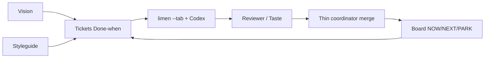
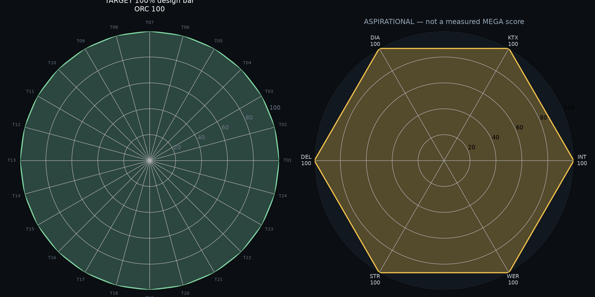
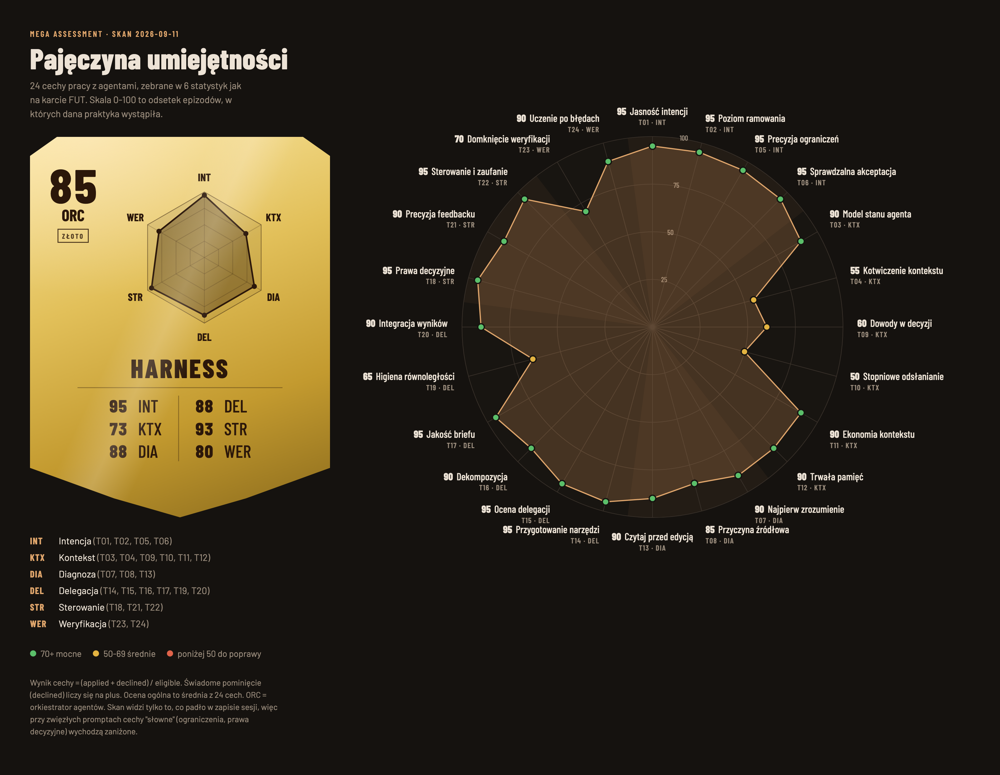

# startup-harness-grok-codex

Public **Grok Bot + Codex + Limen** delivery harness: same base as the Codex-only harness, **plus** Grok token-budget rules (thin coordinator, Delivery owns the loop, no FYI spam).

Independent git history from [`startup-harness-codex`](https://github.com/lmiadowicz/startup-harness-codex) — copy patterns freely; not a fork remote.

## Get Limen

**Download Limen from:** https://mega.dev/autonomous-product-development  

You can download Limen there (and related Herdr tooling).

## How it works



| Piece | Role |
| --- | --- |
| **Board** | STATUS / ACTIONS + NOW / NEXT / PARK |
| **Vision** | `spec/vision.md` — product north star |
| **Styleguides** | `spec/styleguide.md` — UI/craft rules |
| **Tickets** | Done-when → limen/Codex → review → merge |
| **Coordinator** | Stays **thin** — merge after PASS / owner taste only (see `grok/TOKEN-BUDGET.md`) |

Details: [`docs/how-it-works.md`](docs/how-it-works.md).

## Install into a project

```bash
git clone https://github.com/lmiadowicz/startup-harness-grok-codex.git
cd startup-harness-grok-codex
bash setup.sh
bash setup.sh /path/to/your-product
export PRODUCT_ROOT=/path/to/your-product
bash "$PRODUCT_ROOT/.agents/delivery/scripts/status-dump.sh"
```

Read `grok/TOKEN-BUDGET.md` before wiring Grok Bot routines.

Full guide: [`docs/install-into-project.md`](docs/install-into-project.md).

## Grok extras (this repo only)

| Path | Purpose |
| --- | --- |
| `grok/TOKEN-BUDGET.md` | Thin coordinator; pause poll crons; Delivery owns STATUS |
| `grok/bot-roles.md` | Delivery / Reviewer / Taste / SDLC / Architect |
| `grok/routines/*.md` | Sample routine prompts (no secrets) |

## Charts (design bars — not measured)

> **CRITICAL:** **TARGET 100%** = design bar, **NOT** measured.  
> **~90%** = harness coverage design goal / example render, **NOT** a claimed measured score.

Rendered with **Piotr’s mega-card** ([piotrkrych2/Random-Skills](https://github.com/piotrkrych2/Random-Skills)).

### TARGET 100%



### ~90% harness coverage (honest gaps)



```bash
npm run charts
# or python3 vendor/mega-card/render.py …
```

## Credits

- **Limen:** https://mega.dev/autonomous-product-development
- **Charts / mega-card:** https://github.com/piotrkrych2/Random-Skills — **piotrkrych2 / mega-card**
- **pstack (optional):** [open-pstack](https://github.com/ericlitman/open-pstack) — see `docs/pstack.md`

See `ATTRIBUTION.md`.

## License

Scripts and docs: use freely. Vendored `vendor/mega-card/` retains upstream attribution.
