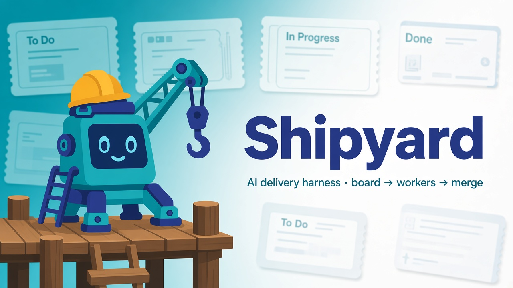
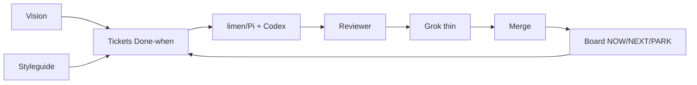
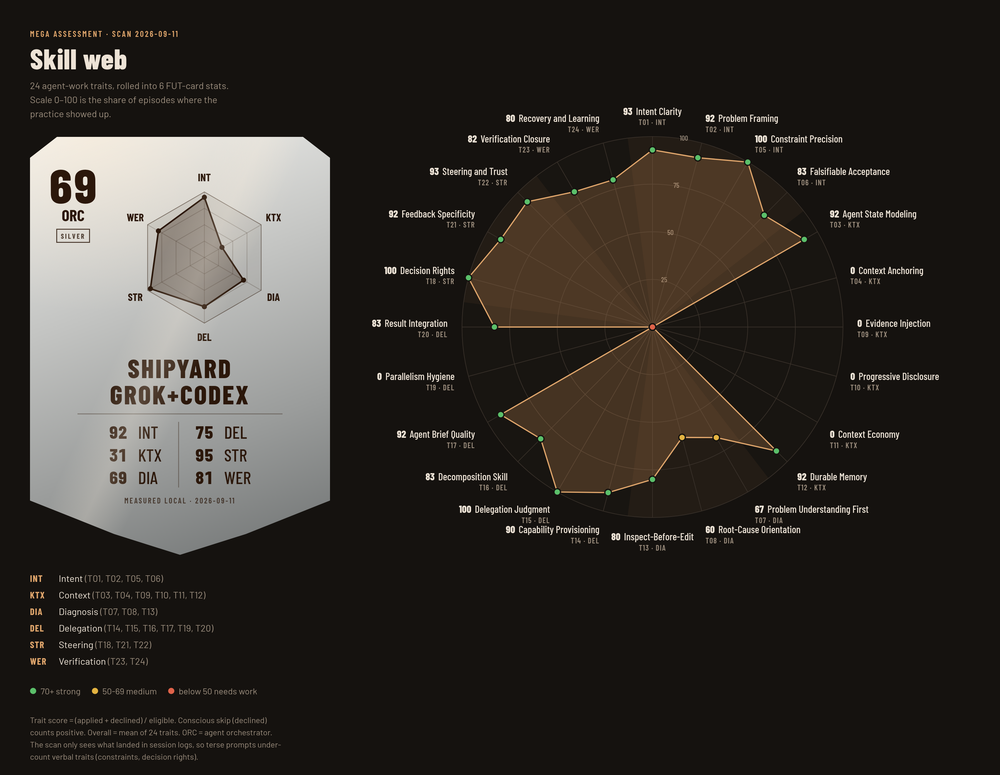

# Shipyard · Grok + Codex

<p align="center">
  
</p>

**AI delivery shipyard for microsaas, tools, and mobile apps** — quality, reliability, and token efficiency.

Public repo name today: [`startup-harness-grok-codex`](https://github.com/lmiadowicz/startup-harness-grok-codex) (branding target: **shipyard-grok-codex**). Sibling: [`startup-harness-codex`](https://github.com/lmiadowicz/startup-harness-codex).

Grok Bot stays a **thin coordinator**. Delivery owns the board loop. Codex + limen/Pi do the coding work.

## Why this exists

Most “agent coding” setups burn tokens, drift UI, and ship half-done PRs. This harness is the opposite posture:

1. **Board first** — NOW / NEXT / PARK so work is visible.
2. **Done-when tickets** — In / Out / Forbidden before any worker starts.
3. **Narrow workers** — limen `--tab` + Codex, max 1–2 live jobs.
4. **Proof before merge** — Reviewer PASS + evidence, not vibes.
5. **Token discipline** — thin Grok, shell/launchd for the loop, no chat spam.

Limen: https://mega.dev/autonomous-product-development · Assessment: https://mega.dev/#assessment · Charts: [piotrkrych2/Random-Skills mega-card](https://github.com/piotrkrych2/Random-Skills)

## How it works (animated)

Open the interactive walkthrough — board fills with successive features while the pipeline lights up:

**→ [`docs/orchestration-animation.html`](docs/orchestration-animation.html)**

What you’ll see:

1. Vision + styleguide seed the work
2. Features land in **PARK**, promote to **NEXT**, pull into **NOW**
3. Ticket gets falsifiable **Done-when**
4. **limen / Pi** workers spawn → **Codex** implements
5. **Reviewer** PASS/HOLD → thin **Grok** for merge/taste → **Merge**
6. Board refills; the next feature ships



## Measured coverage (not a target fantasy)

Local scan **2026-09-11** — **measured ORC 69**. Gaps at **T04 / T09 / T10 / T11 / T19** are often unmeasured (scored 0), not silently filled to 90%.



Source: [`charts/mega-assessment-MEASURED-grok-codex.md`](charts/mega-assessment-MEASURED-grok-codex.md). Rebuild: `npm run charts` (TypeScript mega-card). How scores work: [`docs/chart-traits.md`](docs/chart-traits.md)..

### What ORC and the traits mean

- **ORC** = mean of 24 trait scores (agent orchestrator score on the FUT card).
- **Trait score** = `(applied + declined) / eligible × 100` (declined = conscious skip, counts positive).
- **Groups:** INT Intent · KTX Context · DIA Diagnosis · DEL Delegation · STR Steering · WER Verification.
- Card metal: **75+ gold**, **65–74 silver**, below **bronze**.

| ID | Trait | What it means in this harness |
| --- | --- | --- |
| T01 | Intent Clarity | Ticket/goal states the outcome in one clear sentence |
| T02 | Problem Framing | Scope framed as a problem, not a pile of tasks |
| T03 | Agent State Modeling | Workers know board/STATUS and what’s already in flight |
| T04 | Context Anchoring | Attachments, branches, and durable context stay visible (often **unmeasured**/0 today) |
| T05 | Constraint Precision | In / Out / Forbidden are explicit |
| T06 | Falsifiable Acceptance | Done-when checks someone can fail |
| T07 | Problem Understanding First | Read before inventing a fix |
| T08 | Root-Cause Orientation | Fix the cause, not the symptom |
| T09 | Evidence Injection | Decisions cite Preview/logs/evidence (often **unmeasured**/0) |
| T10 | Progressive Disclosure | Don’t dump the whole repo into every prompt (often **unmeasured**/0) |
| T11 | Context Economy | Compact context; avoid token waste (often **unmeasured**/0) |
| T12 | Durable Memory | Vision, styleguide, playbook persist across sessions |
| T13 | Inspect-Before-Edit | Read the code path before patching |
| T14 | Capability Provisioning | limen/`--tab`, tools, and scripts are ready |
| T15 | Delegation Judgment | Right worker for the ticket; max 1–2 live |
| T16 | Decomposition Skill | Big goals split into shippable tickets |
| T17 | Agent Brief Quality | Briefs are tight and actionable |
| T18 | Decision Rights | Who merges / who only advises (thin coordinator) |
| T19 | Parallelism Hygiene | No colliding workers on the same surface (often **unmeasured**/0) |
| T20 | Result Integration | PR + board update + STATUS stay consistent |
| T21 | Feedback Specificity | Review comments are concrete |
| T22 | Steering and Trust | Owner steers taste; automation owns the loop |
| T23 | Verification Closure | Reviewer PASS + evidence before merge |
| T24 | Recovery and Learning | Failures become playbook/ticket upgrades |

Closing unmeasured gaps (especially KTX + parallelism) is how measured ORC moves toward ~90% — by process and evidence, never by redrawing a TARGET chart.

## Install (Mac + VPS)

```bash
git clone https://github.com/lmiadowicz/startup-harness-grok-codex.git
cd startup-harness-grok-codex
bash setup.sh              # check tools; offer herdr / Pi / limen links
bash setup.sh /path/to/your-product
export PRODUCT_ROOT=/path/to/your-product
bash "$PRODUCT_ROOT/.agents/delivery/scripts/status-dump.sh"
```

Tooling links (setup prints these too):

| Tool | Install |
| --- | --- |
| **herdr** | `curl -fsSL https://herdr.dev/install.sh \| bash` · [herdrdev/herdr](https://github.com/herdrdev/herdr) |
| **Pi** | [pi.dev](https://pi.dev) / coding-agent packages |
| **limen** | Download from [mega.dev autonomous product development](https://mega.dev/autonomous-product-development) (no public GH mirror yet) |
| **Codex** | OpenAI Codex CLI / ChatGPT Codex desktop |
| **gh** | https://cli.github.com/ |

## Quality bar (pstack)

Recommended: [open-pstack](https://github.com/ericlitman/open-pstack) / [cursor pstack](https://github.com/cursor/plugins/tree/main/pstack). See [`docs/pstack.md`](docs/pstack.md) — `poteto-mode`, `how`, `architect`, `unslop`, verification skills, `principle-guard-the-context-window`, …

## Grok extras

| Path | Purpose |
| --- | --- |
| `grok/TOKEN-BUDGET.md` | Thin coordinator; Delivery owns STATUS; no FYI spam |
| `grok/bot-roles.md` | Delivery / Reviewer / Taste / SDLC / Architect |
| `docs/brand/` | Mascot banner + icon |
| `docs/orchestration-animation.html` | Board + flow animation |

## What’s in the box

| Path | Purpose |
| --- | --- |
| `.agents/delivery/` | Playbook, ticket template, orchestrate / review / status scripts |
| `board/` | Sample NOW/NEXT/PARK + STATUS/ACTIONS |
| `spec/` | Sample vision + styleguide |
| `charts/` | Measured mega-card PNG + assessment markdown |
| `vendor/mega-card/` | Piotr mega-card renderer (attributed) |
| `setup.sh` | Mac + VPS installer |

## License

Scripts and docs: use freely. Vendored `vendor/mega-card/` keeps upstream attribution. Limen / pstack / Codex remain under their own terms.
