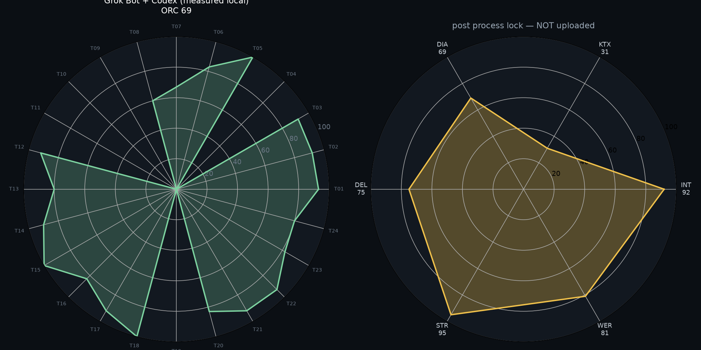
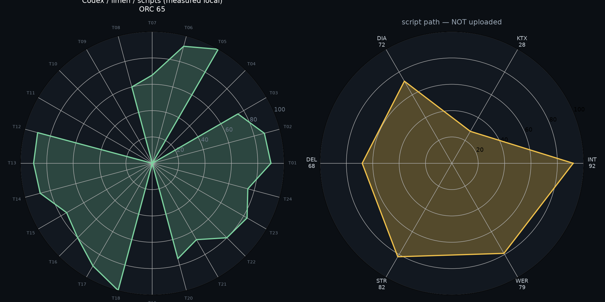
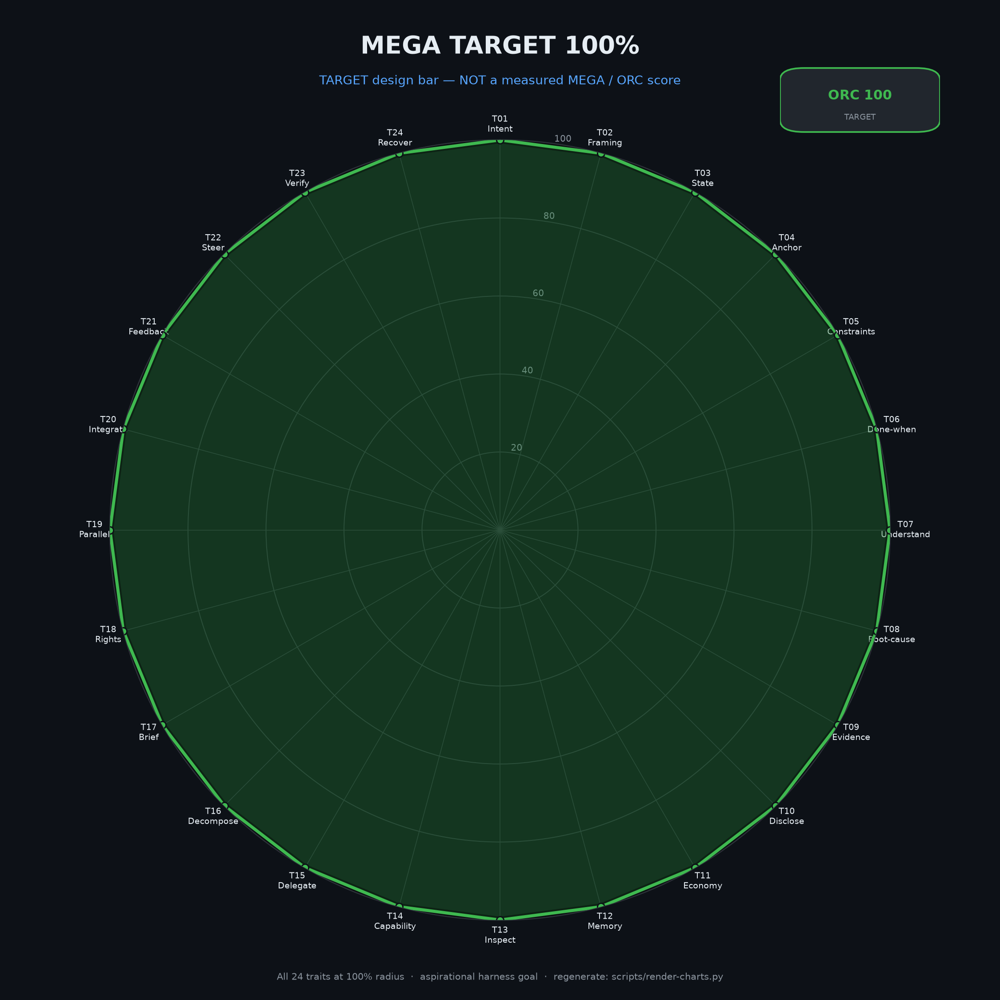

# startup-harness-grok-codex

Public **Grok Bot + Codex + Limen** delivery harness: same base as the Codex-only harness, **plus** Grok token-budget rules (thin coordinator, Delivery owns the loop, no FYI spam).

Independent git history from [`startup-harness-codex`](https://github.com/lmiadowicz/startup-harness-codex) — copy patterns freely; not a fork remote.

## Get Limen

**Download Limen from:** https://mega.dev/autonomous-product-development  

You can download Limen there (and related Herdr tooling). This harness assumes `limen` / `herdr` / `gh` / Codex are available on your Mac PATH.

## Quick start

```bash
git clone https://github.com/lmiadowicz/startup-harness-grok-codex.git
cd startup-harness-grok-codex
bash setup.sh
bash setup.sh /path/to/your-product
export PRODUCT_ROOT=/path/to/your-product
bash "$PRODUCT_ROOT/.agents/delivery/scripts/status-dump.sh"
```

Read `grok/TOKEN-BUDGET.md` before wiring Grok Bot routines.

## Grok extras (this repo only)

| Path | Purpose |
| --- | --- |
| `grok/TOKEN-BUDGET.md` | Thin coordinator; pause poll crons; Delivery owns STATUS; wake only for merge/taste |
| `grok/bot-roles.md` | Delivery / Reviewer / Taste / SDLC / Architect one-liners |
| `grok/routines/*.md` | Sample routine prompts (markdown only, no secrets) |

## Shared package (with Codex harness)

| Path | Purpose |
| --- | --- |
| `.agents/delivery/scripts/` | orchestrate / review-and-label / status-dump / smoke / install-launchd |
| `.agents/delivery/PLAYBOOK.md` + `TICKET-TEMPLATE.md` | Quality bar |
| `docs/pstack.md` | pstack pointers |
| `setup.sh` | tool checks + install into product repo |
| `scripts/render-charts.py` | rebuild TARGET charts |
| `vendor/mega-card/` | chart skill (attributed) |

## Charts (TARGET / design bar)

> **CRITICAL:** Charts showing **100%** are a **TARGET / design bar**, **NOT** a measured assessment score. Do **not** claim measured 100% / ORC 100%.

### TARGET 100%


### Grok + Codex path



### Codex-only path (comparison)



### Matplotlib rebuild



```bash
python3 -m venv .venv && .venv/bin/pip install matplotlib
.venv/bin/python scripts/render-charts.py
```

## Credits

- **Limen:** get limen from https://mega.dev/autonomous-product-development — you can download Limen there.
- **Charts / mega-card skill:** https://github.com/piotrkrych2/Random-Skills — credit **piotrkrych2 / mega-card** for FUT card + 24-spoke spider charts (vendored under `vendor/mega-card/`).
- **pstack quality bar (optional):** Lauren Tan / poteto style — [open-pstack](https://github.com/ericlitman/open-pstack); see `docs/pstack.md`. Keep LICENSE notices if packaging from open-pstack.

See `ATTRIBUTION.md`.

## License

Scripts and docs in this repo: use freely for your product harness. Vendored `vendor/mega-card/` retains upstream attribution. Upstream limen / pstack / Codex / Grok remain under their own terms.
