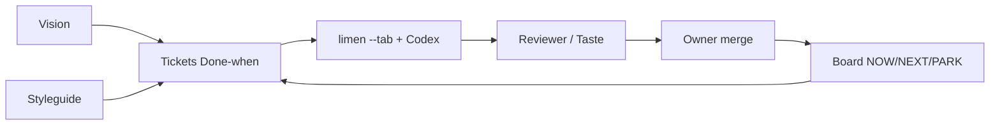

# How it works

## English

1. **Vision** (`spec/vision.md`) — product north star. Agents read it before expanding scope.
2. **Styleguides** (`spec/styleguide.md`) — UI/craft rules workers must follow (density, motion, a11y, “taste fails if”).
3. **Board** — tracks work: `STATUS.md` + `ACTIONS.json` + NOW/NEXT/PARK ticket board.
4. **Tickets** — each has In/Out/Forbidden + **Done-when** (falsifiable checks).
5. **Workers** — limen `--tab` + Codex implement one ticket at a time (max 1–2 live).
6. **Review → merge** — Reviewer PASS (+ Taste for UI) before owner merge. Evidence under `.verification/evidence/`.

## Polski (krótko)

1. **Vision** — dokąd idzie produkt.
2. **Styleguide** — reguły UI/craft dla agentów.
3. **Board** — NOW/NEXT/PARK + STATUS/ACTIONS.
4. **Tickety** z Done-when → limen/Codex → review → merge.
